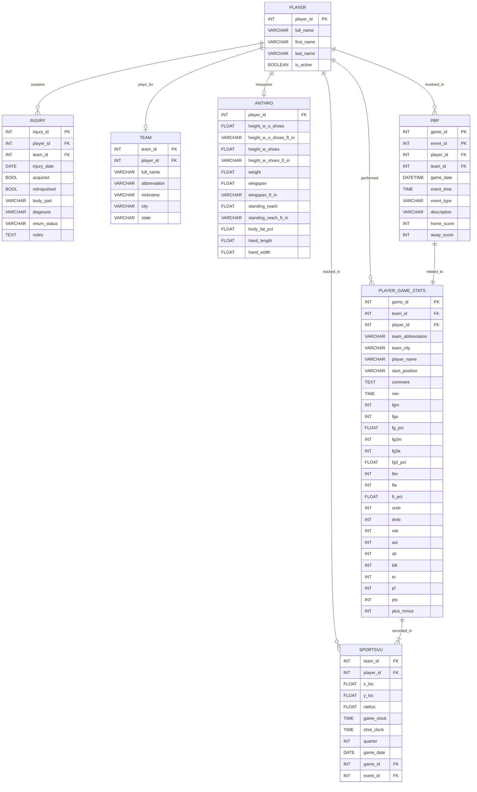

```mermaid
erDiagram
    PLAYER ||--o{ INJURY : sustains
    PLAYER ||--o| TEAM : plays_for
    PLAYER ||--o| ANTHRO : measures
    PLAYER ||--o{ PLAYER_GAME_STATS : performed
    PLAYER ||--o{ SPORTSVU : tracked_in
    PLAYER_GAME_STATS ||--|{ SPORTSVU : recorded_in
    PLAYER ||--o{ PBP : involved_in
    PBP ||--|| PLAYER_GAME_STATS : related_to   

    PLAYER {
        INT player_id PK
        VARCHAR full_name
        VARCHAR first_name
        VARCHAR last_name
        BOOLEAN is_active
    }

    ANTHRO {
        INT player_id FK
        FLOAT height_w_o_shoes
        VARCHAR height_w_o_shoes_ft_in
        FLOAT height_w_shoes
        VARCHAR height_w_shoes_ft_in
        FLOAT weight
        FLOAT wingspan
        VARCHAR wingspan_ft_in
        FLOAT standing_reach
        VARCHAR standing_reach_ft_in
        FLOAT body_fat_pct
        FLOAT hand_length
        FLOAT hand_width
    }

    TEAM {
        INT team_id   PK
        INT player_id FK
        VARCHAR full_name
        VARCHAR abbreviation
        VARCHAR nickname
        VARCHAR city
        VARCHAR state
    }

    INJURY {
        INT injury_id PK
        INT player_id FK
        INT team_id   FK    
        DATE injury_date
        BOOL acquired
        BOOL relinquished
        VARCHAR body_part   
        VARCHAR diagnosis   
        VARCHAR return_status 
        %%[ 'GTD', 'DTD', 'out-for-season' ]
        TEXT notes
    }

    PLAYER_GAME_STATS {
        INT game_id PK
        INT team_id FK
        INT player_id FK
        VARCHAR team_abbreviation
        VARCHAR team_city
        VARCHAR player_name
        VARCHAR start_position
        TEXT comment
        TIME min
        INT fgm
        INT fga
        FLOAT fg_pct
        INT fg3m
        INT fg3a
        FLOAT fg3_pct
        INT ftm
        INT fta
        FLOAT ft_pct
        INT oreb
        INT dreb
        INT reb
        INT ast
        INT stl
        INT blk
        INT to
        INT pf
        INT pts
        INT plus_minus
    }

    SPORTSVU {
        INT team_id FK
        INT player_id FK
        FLOAT x_loc
        FLOAT y_loc
        FLOAT radius
        TIME game_clock
        TIME shot_clock
        INT quarter
        DATE game_date
        INT game_id FK
        INT event_id FK
    }

    PBP {
        INT game_id PK
        INT event_id PK
        INT player_id FK
        INT team_id FK
        DATETIME game_date
        TIME event_time
        VARCHAR event_type
        VARCHAR description
        INT home_score
        INT away_score
    }
```