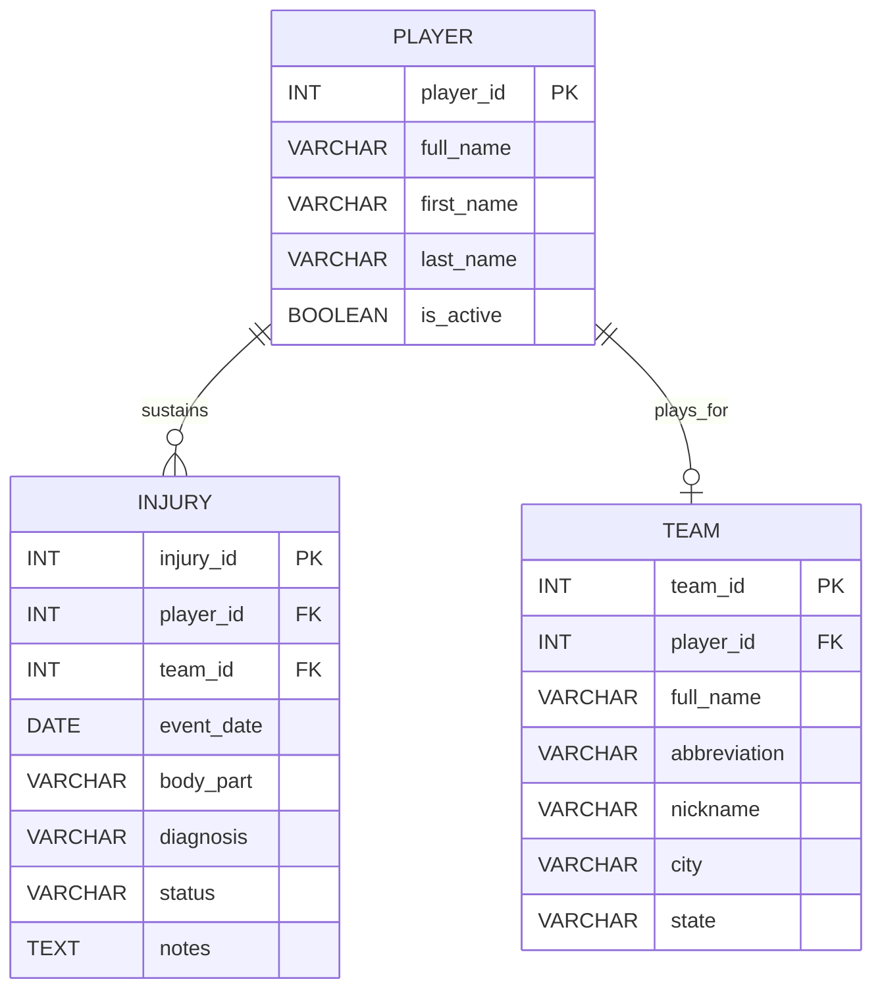

```mermaid
erDiagram
    %% PLAYER ||--o{ ROSTER : appears_in
    %% TEAM   ||--o{ ROSTER : fields
    PLAYER ||--o{ INJURY : sustains
    PLAYER ||--o| TEAM : plays_for
    %% TRANSACTION ||--o{ TRANSACTION_PLAYER : includes
    %% PLAYER ||--o{ TRANSACTION_PLAYER : participates

    PLAYER {
        INT player_id PK
        VARCHAR full_name
        VARCHAR first_name
        VARCHAR last_name
        BOOLEAN is_active
    }

    TEAM {
        INT team_id   PK
        INT player_id FK
        VARCHAR full_name
        VARCHAR abbreviation
        VARCHAR nickname
        VARCHAR city
        VARCHAR state
    }

    %% ROSTER {
    %%     INT roster_id PK
    %%     INT player_id FK
    %%     INT team_id   FK
    %%     VARCHAR position    
    %%     DATE start_date   
    %%     DATE end_date
    %%     VARCHAR season 
    %% }

    INJURY {
        INT injury_id PK
        INT player_id FK
        INT team_id   FK    
        DATE event_date
        VARCHAR body_part   
        VARCHAR diagnosis   
        VARCHAR status 
        %% DATE expected_return
        %% BOOLEAN out_for_season
        TEXT notes
        %% VARCHAR source 
        %% VARCHAR source_url
    }

    %% TRANSACTION {
    %%     INT transaction_id PK
    %%     DATE event_date
    %%     INT team_id FK 
    %%     TEXT notes
    %%     VARCHAR source
    %%     VARCHAR source_url
    %% }

    %% TRANSACTION_PLAYER {
    %%     INT id PK
    %%     INT transaction_id FK
    %%     INT player_id FK
    %%     ENUM role 
    %% }
```
