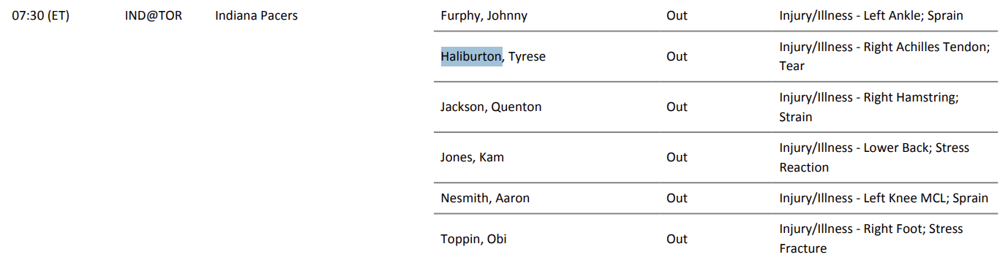
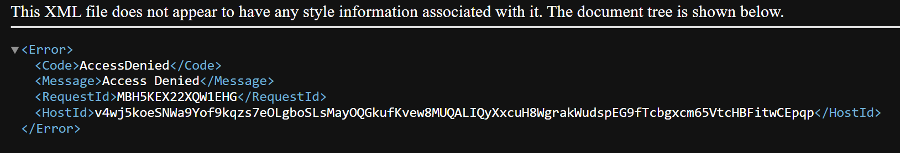

#### NBA Injury Report Data

Views [This Link](https://official.nba.com/nba-injury-report-2025-26-season/)
For info on how the injury report works

Essentialy a pdf uploaded by the hour @ every XX:30, updated which players are injured, questionable, out, etc.

This data stacks. What this means is that even though a player may have not been injured since last update, they still show up as out. For example, although Haliburton was not injured today (months ago), he still shows up as out.

I'm assuming ProSportsTransactions updates their lists based off of the diffs of these PDFs, but it never hurts to check.

The PDF within this directory is the earliest one that a normal person can access 2021-10-19-00:00.
Anything earlier you get this.

To traverse through injury reports of different dates, using the URL, heres the pattern
https://ak-static.cms.nba.com/referee/injury/Injury-Report_YYYY-MM-DD_HH(A|P)M.pdf