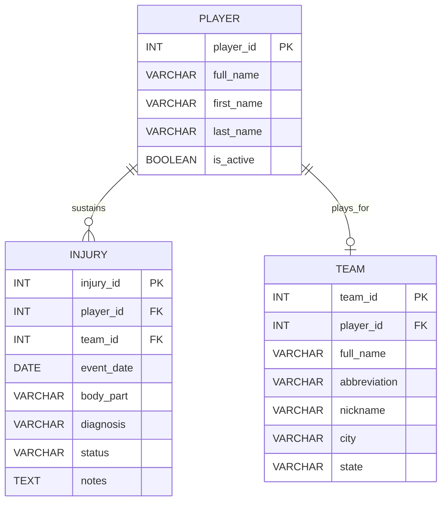

```mermaid
erDiagram
    PLAYER ||--o{ INJURY : sustains
    PLAYER ||--o| TEAM : plays_for

    PLAYER {
        INT player_id PK
        VARCHAR full_name
        VARCHAR first_name
        VARCHAR last_name
        BOOLEAN is_active
    }

    TEAM {
        INT team_id   PK
        INT player_id FK
        VARCHAR full_name
        VARCHAR abbreviation
        VARCHAR nickname
        VARCHAR city
        VARCHAR state
    }

    INJURY {
        INT injury_id PK
        INT player_id FK
        INT team_id   FK    
        DATE event_date
        VARCHAR body_part   
        VARCHAR diagnosis   
        VARCHAR status 
        %%[ 'GTD', 'DTD', 'out-for-season' ]
        TEXT notes
    }
```
